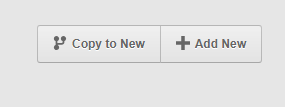
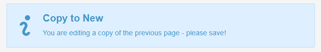

# [Copy to New (clone)](https://github.com/trendoman/Addons)

Addon brings an action via a new button 'Copy to New' that clones page into another one with same data.



Additionally, an alert is displayed on the clone



## Usage

Within the 'copy-to-new' folder we added to addons above, you'll find a 'example.config.php' file.

Rename it to 'config.php' and open it in your text editor. Add to the following setting the name(s) of the templates you'd like to add this copy to new page feature -

```php
$cfg['tpls'] = '';
```

For example, if you wanted to add it to 'portfolio.php', the setting will become -

```php
$cfg['tpls'] = 'portfolio.php';
```

Multiple templates may be added by separating them with a pipe (i.e. '|') character e.g.

```php
$cfg['tpls'] = 'portfolio.php | contacts.php ';
```

And now when you wish to create a new page copying data from an existing page (of the templates specified in config above), open that page for editing in the admin-panel and you should see a new button on the top of the screen -


Clicking it will open the familiar 'Add new' screen but this time the form would be pre-populated with data taken from the page we clicked the button on.

You may edit the page further to make changes if required and press save to create your new page.

## Customization

### Alert

- `copy-to-new-alert.php`

File contains code for the alert. Alternative to PHP, a solution would be to add a custom alert code directly to the template, thanks to the system variable **k_route_name** which is set to *copy_view*.

```xml
<cms:config_form_view>

    <cms:html>
        <cms:if k_route_name = 'copy_view' >
            <div class="alert alert-notice alert-icon">
                <cms:show_icon 'warning' />
                <h4>You are editing a copy of the previous page - please save!</h4>
            </div>
        </cms:if>
    </cms:html>

</cms:config_form_view>
```

### Frontend Link

A link to a new clone can be obtained programmatically. The variable **k__clonepage_link** has it. It is added to autoloader with addon.

### Clone page programmatically

Your best bet would probably be using **cms:db_persist** tag within the page-view (utilizing **cms:pages** tag outside of page-view).

```xml
<cms:pages masterpage='index.php' id='92'>
    <cms:db_persist
        _mode = 'create'
        _masterpage = k_template_name
        k_page_title = k_page_title
        mytextfield1 = mytextfield1
        image = image
        myrepeatable = "<cms:show_repeatable 'myrepeatable' as_json='1' />"
    >
        <cms:each k_error as='err'><cms:show err /></cms:each>
        <cms:dump />
    </cms:db_persist>
</cms:pages>
```

Above code will produce something along the lines –

```
db_persist
    k_success: 1
    k_error:
    k_error_count: 0
    k_persist_error_count: 0
    k_last_insert_id: 111
    k_last_insert_page_name: test-page-2
```

All necessary fields can be written-in quickly similarly to how I wrote *mytextfield1 = mytextfield1* etc. The main advantage is that **you can tweak fields and amend values as you like** or have them identical.

The code above **will not copy Mosaic tiles** – it's the only drawback that I know. Repeatable region are OK, as should take a JSON value as displayed above.


## Installation

Move addon to `/addons-enabled/` folder (if using autoloader) or follow the regular method -

1. Extract the folder named 'copy-to-new' from the attached zip and place it in 'couch/addons' folder.
2. Activate the addon by adding the following entry in 'couch/addons/kfunctions.php' file (if this file is not present, rename 'kfunctions.example.php' to 'kfunctions.php') -

```php
require_once( K_COUCH_DIR.'addons/copy-to-new/__autoload.php' );
```

## Related pages

* [**https://www.couchcms.com/forum/viewtopic.php?f=8&t=11545**](https://www.couchcms.com/forum/viewtopic.php?f=8&t=11545) — source post and discussion
* **Variables » k__clonepage_link**
