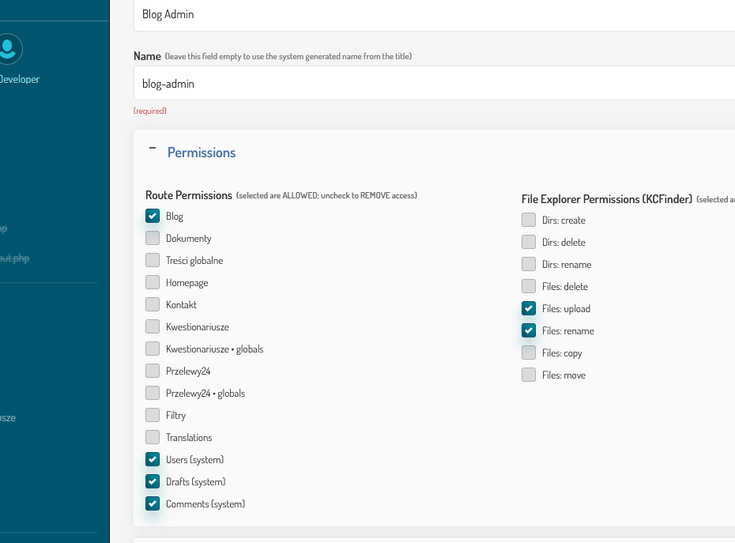
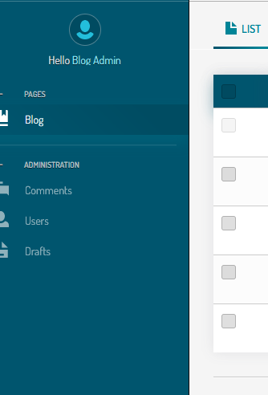
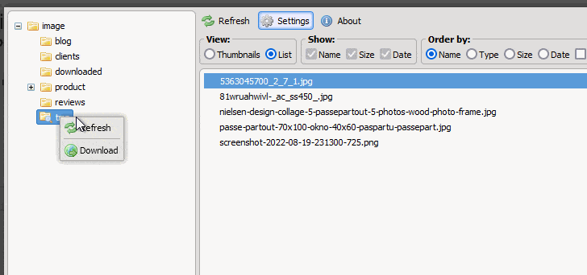

# [Access control](https://github.com/trendoman/Addons)

With this addon Superadmin decides which page in Admin panel is not accessible for an Administrator.

Setting permissions for the File Explorer (KCFinder) is enabled by default as well.



The result of the above configuration for the "Blog Admin" is the only available sidebar item – blog –



– and inability to delete files from server (play `►` gif)



---

Addon works if the Extended Users addon is enabled, because the new editable field is placed into the configured users template (variable `$t['users_tpl']` in the config).

## Licence

Open source but not freeware. Code & 6 months support is ***$50***.

## Installation

View **[INSTALL](/INSTALL.md)** file for info.

Installation remains the same as with other addons[^1].

[^1]: https://github.com/trendoman/Midware/tree/main/concepts/Extended-Users#installation

```php
require_once( K_COUCH_DIR.'addons/access-control/access-control.php' );
```

Repository [**Extended KFunctions**](https://github.com/trendoman/Extended-KFunctions) already includes the reference line above.

## Related pages


## Support

Hello, I'm Anton, the author of this addon. Email me and I'll try to help you.

[](mailto:"Anton"<tony.smirnov@gmail.com>?subject=[GitHub])
