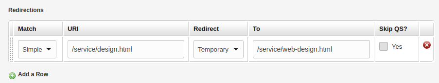
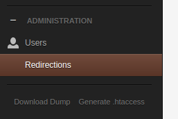
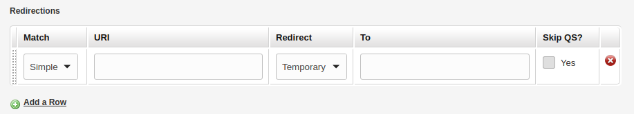
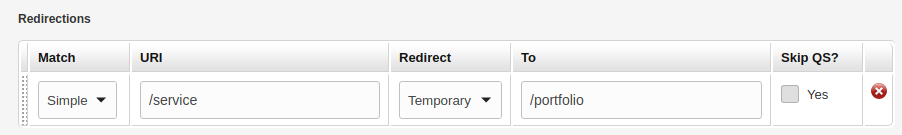
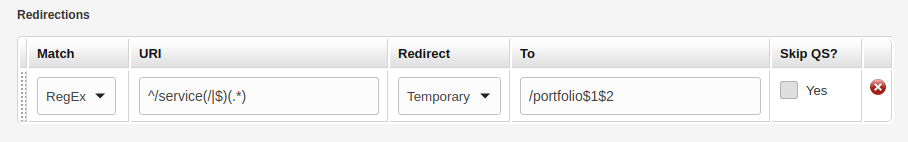

# [Redirector](https://github.com/trendoman/Addons)

For sites that have been around for some time, it is a pretty common requirement to rename pages/folders or to rename templates. This, of course, modifies their links and then SEO considerations dictate that the older links redirect to the revised locations instead of throwing 404 errors.



Before moving on further with the discussion, I'd like to mention upfront that there are two requirements for this addon –

1. The site needs to be using prettyURLs (https://docs.couchcms.com/concepts/pretty-urls.html).

   Since we are assuming the site is already in production, and SEO is a consideration, this should be a non-issue.

2. One of the Couch templates used by the site should be 'index.php'.

   Again, generally this is the very first template that gets ported to Couch in a site so this also should be a non-issue.

OK, so let's begin by installing the addon.

## Installation

View **[INSTALL](/INSTALL.md)** file for info.

The folder contains two elements - a 'redirector.php' and 'example.redirections.php'. The two elements need to be placed in two different locations.

1. Move the 'redirector' folder to within the 'couch/addons/' folder of your site.

    Edit to add the following line of code in `couch/addons/kfunctions.php` file (if the file is not present, rename the `kfunctions.example.php` file found in the same folder to 'kfunctions.php') -

    ```php
    require_once( K_COUCH_DIR.'addons/redirector/redirector.php' );
    ```

    Note: repository [**Extended KFunctions**](https://github.com/trendoman/Extended-KFunctions) already has this line.

2. Move the file 'example.redirections.php' to within the root of your website.

    This file is actually a bonafide Couch template (like the other templates in the root of your site) and you'll now need to register it. Rename it to 'redirections.php', login as super-admin and then visit https://www.place_yoursite_here.com/redirections.php.

Coming back to the admin-panel, you should see a new item added beneath the 'Administration' heading in the sidebar.



Clicking on it should show you this -



## Usage

As should be evident from the screenshot above, you can enter your redirection rules here.\
Let us enter some now -

Suppose 'https://yoursite.com/service/design.html' (where 'service' is the template named service.php and 'design' is the page's name) no longer exists because you have renamed the page from 'design' to 'web-design' (which makes 'https://yoursite.com/service/web-design.html' the new URL).

Following rule entered into the table will make sure anyone still accessing the non-existent URL will be redirected to the new URL instead -


i.e. the redirection will take place as follows -

    'https://yoursite.com/service/design.html' => 'https://yoursite.com/portfolio/design.html'

Now suppose we had to rename the template itself from 'service' to 'portfolio'; this invalidates the URLs of all folders and pages belonging to the template and we wish to redirect them all to the newer URLs.

Following single rule would do just that -



With the rule above, the redirections will take place as follows -

    'https://yoursite.com/service/' => 'https://yoursite.com/portfolio/'
    'https://yoursite.com/service/web/' => 'https://yoursite.com/portfolio/web/'
    'https://yoursite.com/service/web/design.html' => 'https://yoursite.com/portfolio/web/design.html'
    'https://yoursite.com/service/web/design.html?x=23&y=42' => 'https://yoursite.com/portfolio/web/design.html?x=23&y=42'

As can be seen in both the rules above, **if the value entered in the 'URI' textbox matches with the 'uri' portion of the current URL, the matched portion is replaced by the value entered in the 'To' text box**.

If you are unclear on exactly what constitues the 'uri', please see the following note -

&gt;>>>>>>>>>>>>>>>>>>>>>>>>>NOTE>>>>>>>>>>>>>>>>>>>>>>>>>>>>>>>>>>

Assuming 'https://yoursite.com/' is your site and following is the URL used to access a page -

    https://yoursite.com/service/design.html?x=23&y=42#target

The URL above consists of the three components -

1. **site_url**: https://yoursite.com
2. **uri**: /service/design.html
3. **query_string**: x=23&y=42

Please notice the following points in the breakup -

* The '#' fragment at the end of the URL above is totally ignored because it is purely a browser construct and is never sent to the server.
* The 'uri' begins with (and contains) the first '/' after the 'site_url' and ends just before the '?' (or the end of the URL if there is no '?').
* The 'query_string', if present, begins after the '?' and goes to the end.

One slight complexity occurs in cases where you have chosen to install 'couch' folder within some sub-folder of the site (instead of the usual location that is site's root).

So suppose the 'couch' folder is located within the 'service' folder of the site's root. In this case, following would be the values for the three mentioned components -

1. **site_url**: https://yoursite.com/service
2. **uri**: /design.html
3. **query_string**: x=23&y=42

As you can see, the 'site_url' now includes the folder in which 'couch' is installed.
The 'uri', as per its definition of beginning with the first '/' after 'site_url', now becomes '/design.html'.

&gt;>>>>>>>>>>>>>>>>>>>>>>>>>NOTE END>>>>>>>>>>>>>>>>>>>>>>>>>>>>>>

Both the examples given above used the 'Simple' option for 'Match' heading.

Mostly that option should suffice for all the common use-cases but if more control is required on what should be matched in the 'uri' and what should be replaced, one may use the 'RegEx' option.

Regular Expressions are beyond the scope of this discussion so I'll just post the RegEx equivalent of the second rule we used above (the one that redirects all '/service' URLs to '/portfolio') -



As can be seen, it is vastly more complex than its simple equivalent. Hopefully, there won't be many occasions where you'll require it.

## Template code

**example.redirections.php**:

```xml
<?php require_once("couch/cms.php"); ?>
<cms:template title='Redirections' clonable='0' executable='0' parent='_modules_' order='100'>

    <cms:repeatable name='redirections' label='Redirections' order='-1'>
        <cms:editable name='match' label='Match' type='dropdown' opt_values='Simple=simple | RegEx=regex' opt_selected='simple' col_width='100' />
        <cms:editable name='uri' label='URI' type='text' required='1' validator='kredirector::validate_match' />
        <cms:editable name='redirect' label='Redirect' type='dropdown' opt_values='Temporary=temporary | Permanent=permanent' opt_selected='temporary' col_width='120' />
        <cms:editable name='to' label='To' type='text' required='1' validator='regex=/^(http|\/)/i' validator_msg="regex=URL should begin with either '/' or 'http'" separator='#'/>
        <cms:editable name='skip_qs' label='Skip QS?' type='checkbox' opt_values='Yes=yes' col_width='90' />
    </cms:repeatable>

</cms:template>
<?php COUCH::invoke(); ?>
```

## Related pages

* [**https://www.couchcms.com/forum/viewtopic.php?f=8&t=13018**](https://www.couchcms.com/forum/viewtopic.php?f=8&t=13018) — source post and discussion
