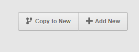
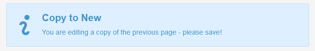

# Клонировать (страницу)

Плагин добавляет кнопку на экран редактирования страницы, по которой создаётся копия текущей страницы со всеми значениями полей.

На клоне показывается уведомление о необходимости сохранить новую страницу.

---

Остальное в процессе перевода, включая поддержку русского языка на кнопке и в уведомлении
