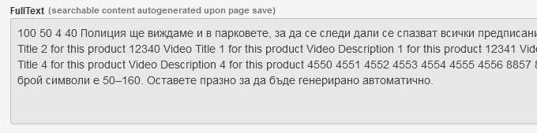

# `<cms:get_fulltext>`

Tag is used to fetch fulltext content for a cloned page.

```xml
<cms:get_fulltext id=k_page_id />
```

Helps review text that will be used for the fulltext search. If you see undesired content, then tweak **searchable** setting for editable fields.

## Example


```xml
<cms:get_fulltext id='14' />
```

↓↓

```txt
100 50 4 40 Полиция ще виждаме и в парковете, за да се следи дали се спазват всички предписания на властите има извънредно положение! ALT Text for this product image 1 ALT Text for this product image 2 PDF Title 1 for this product PDF Title 2 for this product 12340 Video Title 1 for this product Video Description 1 for this product 12341 Video Title 2 for this product Video Description 2 for this product 12342 Video Title 3 for this product Video Description 3 for this product 12343 Video Title 4 for this product Video Description 4 for this product 4550 4551 4552 4553 4554 4555 4556 8857 8858 125 525 15 978–0141026626 978–0141026626 Използва се като описание при показване при резултат от търсене в Гугъл, оптимален брой символи е 50–160. Оставете празно за да бъде генерирано автоматично.
```

A junk in the searchable content means some fields should be excluded from search or their default values optimized.

## Admin-panel field

Place a dynamic field in template to view the content —



```xml
<cms:config_form_view>

  <cms:field 'fulltext' no_wrapper='1'><br>
    <label class="field-label" for="fulltext">
      <span>FullText</span><span class="desc">(searchable content autogenerated upon page save)</span>
    </label><br>
    <cms:set rows = "<cms:if k_page_id eq '-1'>1<cms:else />5</cms:if>" />
    <textarea id="fulltext" name="fulltext" class="textarea" rows="<cms:show rows />" style="background-color: #e8e8e8; height: auto" readonly><cms:if k_page_id eq '-1'>* page not saved *</cms:if><cms:get_fulltext id=k_page_id /></textarea>
  </cms:field>

</cms:config_form_view>
```

Make sure you understand the MySQL fulltext [^1] indexing strategy — by default settings, words less than 4 and more than 84 characters will be ignored; as well as the stop words —

<details><summary>Stop words</summary>
a's able about above
according accordingly across actually
after	afterwards	again	against
ain't	all	allow	allows
almost	alone	along	already
also	although	always	am
among	amongst	an	and
another	any	anybody	anyhow
anyone	anything	anyway	anyways
anywhere	apart	appear	appreciate
appropriate	are	aren't	around
as	aside	ask	asking
associated	at	available	away
awfully	be	became	because
become	becomes	becoming	been
before	beforehand	behind	being
believe	below	beside	besides
best	better	between	beyond
both	brief	but	by
c'mon	c's	came	can
can't	cannot	cant	cause
causes	certain	certainly	changes
clearly	co	com	come
comes	concerning	consequently	consider
considering	contain	containing	contains
corresponding	could	couldn't	course
currently	definitely	described	despite
did	didn't	different	do
does	doesn't	doing	don't
done	down	downwards	during
each	edu	eg	eight
either	else	elsewhere	enough
entirely	especially	et	etc
even	ever	every	everybody
everyone	everything	everywhere	ex
exactly	example	except	far
few	fifth	first	five
followed	following	follows	for
former	formerly	forth	four
from	further	furthermore	get
gets	getting	given	gives
go	goes	going	gone
got	gotten	greetings	had
hadn't	happens	hardly	has
hasn't	have	haven't	having
he	he's	hello	help
hence	her	here	here's
hereafter	hereby	herein	hereupon
hers	herself	hi	him
himself	his	hither	hopefully
how	howbeit	however	i'd
i'll	i'm	i've	ie
if	ignored	immediate	in
inasmuch	inc	indeed	indicate
indicated	indicates	inner	insofar
instead	into	inward	is
isn't	it	it'd	it'll
it's	its	itself	just
keep	keeps	kept	know
knows	known	last	lately
later	latter	latterly	least
less	lest	let	let's
like	liked	likely	little
look	looking	looks	ltd
mainly	many	may	maybe
me	mean	meanwhile	merely
might	more	moreover	most
mostly	much	must	my
myself	name	namely	nd
near	nearly	necessary	need
needs	neither	never	nevertheless
new	next	nine	no
nobody	non	none	noone
nor	normally	not	nothing
novel	now	nowhere	obviously
of	off	often	oh
ok	okay	old	on
once	one	ones	only
onto	or	other	others
otherwise	ought	our	ours
ourselves	out	outside	over
overall	own	particular	particularly
per	perhaps	placed	please
plus	possible	presumably	probably
provides	que	quite	qv
rather	rd	re	really
reasonably	regarding	regardless	regards
relatively	respectively	right	said
same	saw	say	saying
says	second	secondly	see
seeing	seem	seemed	seeming
seems	seen	self	selves
sensible	sent	serious	seriously
seven	several	shall	she
should	shouldn't	since	six
so	some	somebody	somehow
someone	something	sometime	sometimes
somewhat	somewhere	soon	sorry
specified	specify	specifying	still
sub	such	sup	sure
t's	take	taken	tell
tends	th	than	thank
thanks	thanx	that	that's
thats	the	their	theirs
them	themselves	then	thence
there	there's	thereafter	thereby
therefore	therein	theres	thereupon
these	they	they'd	they'll
they're	they've	think	third
this	thorough	thoroughly	those
though	three	through	throughout
thru	thus	to	together
too	took	toward	towards
tried	tries	truly	try
trying	twice	two	un
under	unfortunately	unless	unlikely
until	unto	up	upon
us	use	used	useful
uses	using	usually	value
various	very	via	viz
vs	want	wants	was
wasn't	way	we	we'd
we'll	we're	we've	welcome
well	went	were	weren't
what	what's	whatever	when
whence	whenever	where	where's
whereafter	whereas	whereby	wherein
whereupon	wherever	whether	which
while	whither	who	who's
whoever	whole	whom	whose
why	will	willing	wish
with	within	without	won't
wonder	would	wouldn't	yes
yet	you	you'd	you'll
you're	you've	your	yours
yourself	yourselves	zero

</details>

[^1]: https://dev.mysql.com/doc/refman/8.0/en/fulltext-search.html

## Installation

Everything described in the dedicated [**INSTALL**](/INSTALL.md) page applies.

## Support

[](mailto:"Anton"<tony.smirnov@gmail.com>?subject=[GitHub])

See dedicated [**SUPPORT**](/SUPPORT.md) page.
