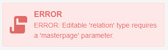

# Auto-update fields

Super-admin reloads Admin-panel page again to see the refreshed fields without visiting page.

And if there is some error in your new code, then you will see a message about it.

