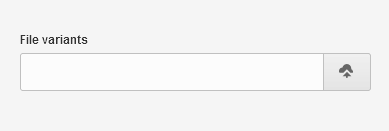

## Оставляем только иконку в поле загрузки файла

Стандартная кнопка –

Проблемка, когда используются колонки:

Убираем длинную надпись

## Автор

Пишите по любым вопросам.

Антон С.\
tony.smirnov@gmail.com
