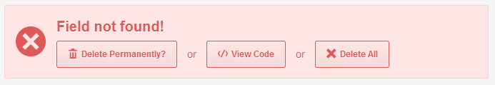
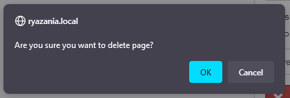
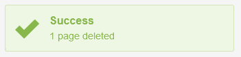

# Тема *Ryazania* для CouchCMS *free

Наша цель — качественно новый опыт работы; это тщательная компиляция и собрание модов, твиков и пр. помощников для ускорения разработки. Если чего-то нехватает, пишем %) Некоторые твики уже интегрированы в файлы темы.

Гораздо больше твиков можно включать-отключать по желанию. Есть 2 типа папок:

+ `*-enabled`
+ `*-available`

где \* обозначает слово.

Если вы переместите папку с твиком из `/tweaks-available/` в `/tweaks-enabled/` то он ***заработает***. Перенесите обратно в `/tweaks-available/` и твик ***отключён***. Так же поступайте с тегами (tags), переменными (vars) и пр.

# список того что есть:

## Галерея с перетаскиванием drag&drop

Упорядочивание фоток в галерее через перетаскивание, а не просто кнопками.

- `/tweaks-enabled/[Gallery] gallery-drag-drop/`
- `content_list_inner_gallery.html`
- `gallery_folder.html`
- `gallery_item.html`

## Быстрое удаление редактируемых полей ввода

Добавили кнопку чтобы удалить все отсутствующие поля из мастер-страницы сразу, а не кликать по каждому алерту отдельно.

Example

- `form_field_deleted.html`

## Кнопки '**Сохранить**' и '**Посмотреть**' продублированы

Чтобы не листать страницу туда-сюда обе кнопки есть наверху и внизу.

- `toolbar.html`
- `page_actions.html`

## Анимированный мягкий скролл вниз

Клик по '**Сохранить**' внизу редактируемой страницы после перезагрузки возвращает в ту же самую область просмотра. Клик по верхней кнопке остаётся как есть.

- `/tweaks-*/[AP Edit-view] animate-scroll-on-save/`

## Различные исправления и твики в CSS

Различные CSS твики для основных полей. Подробности в комментариях в самом CSS файле темы:

- `styles.css`

## Можно вернуться на исходную связанную страницу

Добавили **`X`** на инфоалерт '**Связана с:**' для закрытия алерта и есть ссылка возврата на страницу-источник связи.

- `filter_related.html`

## Кнопка просмотра связанной страницы

Добавили кнопку '**Просмотреть**' в расширенный вид селектора связанных страниц (**advanced_gui='1'**). По кнопке переходим на связанную страницу. Кнопка 'Управлять' включена по умолчанию, где возможно.

- `field_relation_advanced.html`

## Код выбора кастомизации отдельной мастер-страницы

Файл содержит код для подгрузки в первую очередь файла темы для мастер-страницы по её названию. Напр. `content_form__blog-php.html` подгрузится для blog.php и `content_form.html` для всех остальных.

- `kfunctions.php`

## Уведомление об удаленных страницах

Показываем сколько страниц удалено.

- `content_list_inner.html`
- `/tweaks-*/[AP List-view] flash-msg-upon-delete/`

## Уведомление о публикации страницы или снятии с публикации

Изменение даты на "неопубликовано" и обратно триггерит всплывающее уведомление в правом нижнем углу.

Оффлайн-Онлайн

- `content_form.html`

## Всегда доступен Grid CSS (grid12.css)

- `content_form.html`

## Твик затенения экрана

Теперь он засветляется слегка.

- `content_list_relation.html`

## Кнопка удаления

в расширенных настройках страницы

- `group_advanced_settings.html`

# and many many more...

Tags, addons, vars, shortcodes, scripts, tweaks, validators.

# Credits

Anton S.\
tony.smirnov@gmail.com
