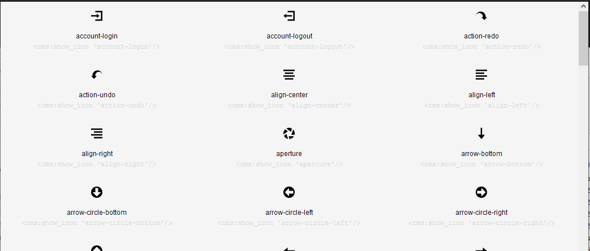

# show-icons

Prints nicely the icons (Open Iconic) from stock CouchCMS theme. Generates a code for stock **show_icon** tag.

```xml
<cms:call 'show-icons' />
```

## Example



## Credits

Your feedback is always solicited. Drop me a mail and I'll try to get back.

Anton S.\
tony.smirnov@gmail.com
