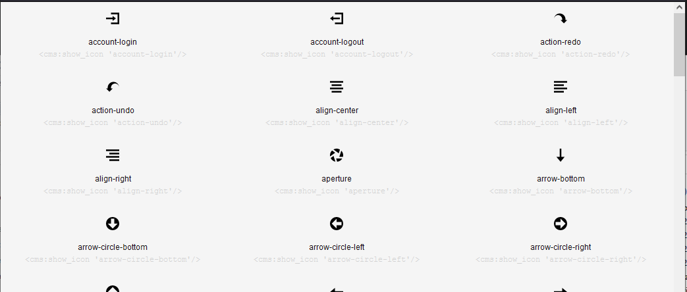

# show-icons

Красиво выводит системные иконки Open Iconic из стоковой CouchCMS темы.

```xml
<cms:call 'show-icons' />
```

## Пример



## Автор

Пишите по любым вопросам

Антон С.\
tony.smirnov@gmail.com
