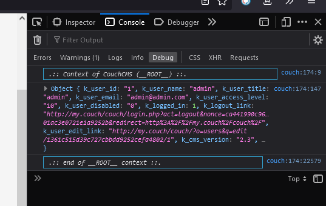

# broc-dump

Our favorite `<cms:dump_all />` now is in the browser's JS console!

Example —

```xml
<cms:call 'broc-dump' />
```

Screenshot —



<details><summary>More screenshots</summary>


</details>

## Usage

Of course this is helpful for Super-admin during development stage.

Can be used on any page of website, but most useful in Admin Panel. Add the following to configuration of a template —

```xml
<cms:config_form_view>

  <cms:html>
      <cms:call 'broc-dump' />
  </cms:html>

</cms:config_form_view>
```

This allows to have all variables of the page before your eyes in console without typing `<cms:dump_all />` and cluttering the page with its printout.

## Related funcs

* **log-dump**

## Credits

Your feedback is always solicited. Drop me a mail and I'll try to get back.

Anton S.\
tony.smirnov@gmail.com
