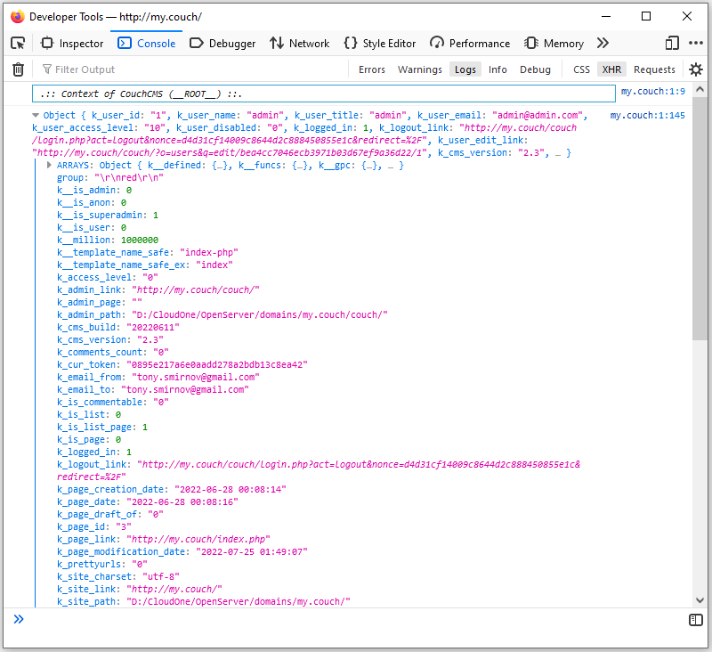
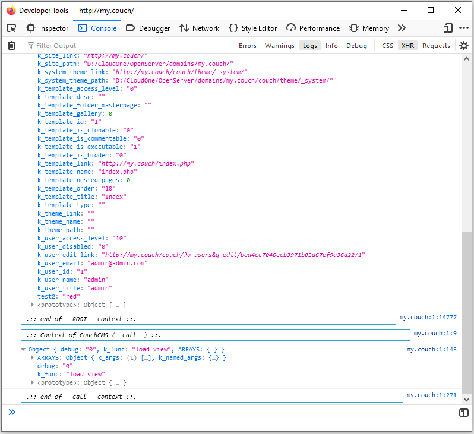

# broc-dump

Любимый дамп переменных `<cms:dump_all />` теперь в консоли браузера!

Пример —

```xml
<cms:call 'broc-dump' />
```

Скриншот —


<details><summary>Еще скрины</summary>




</details>

## Использование

Очень помогает Супер-админу в разработке. Можно поставить вызов функции на любую страницу сайта, но особенно полезно будет в админке, если сконфигурировать Мастер-страницу так:

```xml
<cms:config_form_view>

  <cms:html>
      <cms:call 'broc-dump' />
  </cms:html>

</cms:config_form_view>
```

Все переменные перед глазами и не надо выводить `<cms:dump_all />` забивая страницу.

## Функции в руку

* **log-dump** — вывод дампа в HTML файл

## Автор

Пишите по любым вопросам

Антон С.\
tony.smirnov@gmail.com
