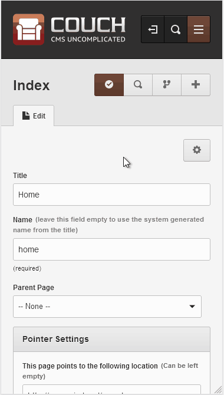

#  Для плагина "copy-to-new" - уведомление

Алертим админу, что он редактирует клон и его надо сохранить.

Эффект видим на каждом клоне.

## Автор

Пишите по любым вопросам.

Антон С.\
tony.smirnov@gmail.com
