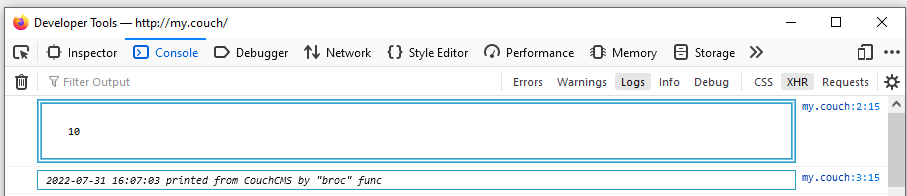
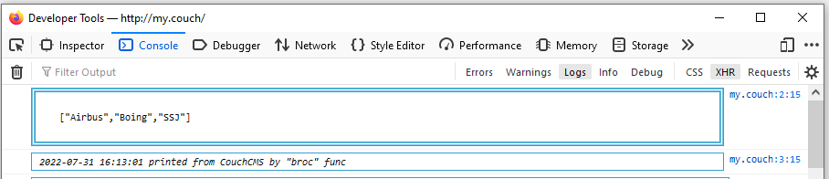
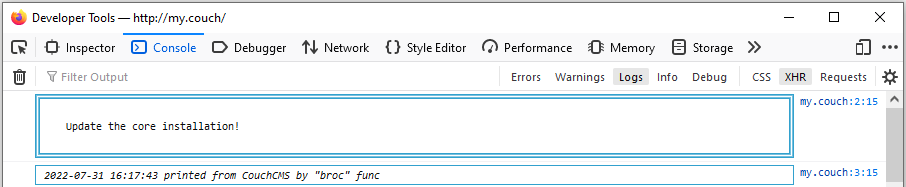

# broc

Name is abbreviation of "Browser Console". Prints any data or variable to the console.

## Example

```xml
<cms:call 'broc' k_user_acces_level />
```

\- displays




```xml
<cms:set rec = '["Airbus", Boing", "SSJ"]' is_json='1' />
<cms:call 'broc' rec />
```

\- displays



```xml
<cms:call 'broc' 'Update the core installation!' />
```

\- displays



## Related funcs

* **[CmsFu » broc-dump](https://github.com/trendoman/Cms-Fu/tree/master/Logs/broc-dump)**

## Installation

**Use [Autoloading](https://github.com/trendoman/Cms-Fu/tree/master/ADDON-FUNCS-ON-DEMAND.md),**

or, alternatively, manually copy the func code to the page before the calling or embed func as a snippet —

```xml
<cms:embed 'funcs/Logs/broc/broc.func' />
```

## Support

[](mailto:"Anton"<tony.smirnov@gmail.com>?subject=[GitHub])

Check out my dedicated [**SUPPORT**](/SUPPORT.md) page.
